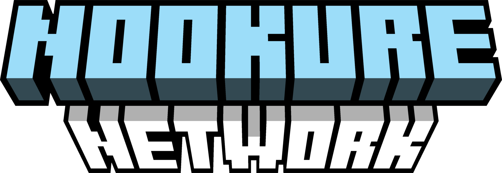

# Nookure Network Wiki

¡Bienvenido a la Wiki Oficial de Nookure Network! Aquí podrás conocer un poco el funcionamiento del servidor, normativas, entre otras cosas interesantes.

<figure><figcaption></figcaption></figure>

## **¿Quiénes somos?** 

Somos una Network de Minecraft llamada "Nookure". El servidor fue fundado el `20 de Diciembre de 2024` por "Petecuh, ralemac7 y Angelillo15" con la modalidad **Survival Clásico**.&#x20;

Anteriormente teníamos otro servidor llamado "Minearte Network" el cual cerró por diversos motivos. Este proyecto nos hizo ganar mucha experiencia para no cometer los mismos errores en el actual proyecto.

Seguimos trabajando continuamente para seguir trayendo más modalidades al servidor, así como actualizaciones y mejoras que harán de Nookure Network, una experiencia única y divertida para tí y tus amigos.

¡Escuchamos las sugerencias e ideas de todos nuestros usuarios para crear un servidor que sea a gusto para toda nuestra comunidad!‌


Cualquier error o duda hacédnoslo saber\
[<mark style="color:blue;">https://discord.nookure.net</mark>](https://discord.nookure.net)


<figure><figcaption>
play.nookure.net
</figcaption></figure>
